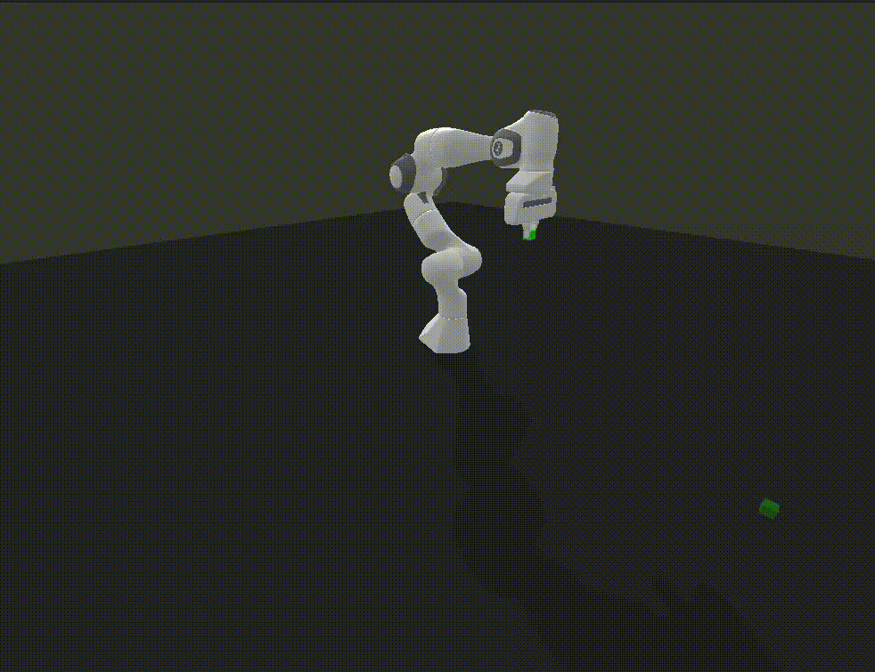

# Winter Project 2024

## Author: 
Anuj Natraj

## Installation Instructions

To install the packages for this project run: `vcs import < tossing.repos`

The gym environment is panda-gym, to install the environment run: `pip install -e panda-gym/`

## Usage

The panda-gym package has the core functionality set up with a custom task of throwing

The training and testing is done in `/RL` directory, training a SAC policy

The toss package and moveit_wrapper are packages to control the real Franka arm

## Simulation

## Real World

